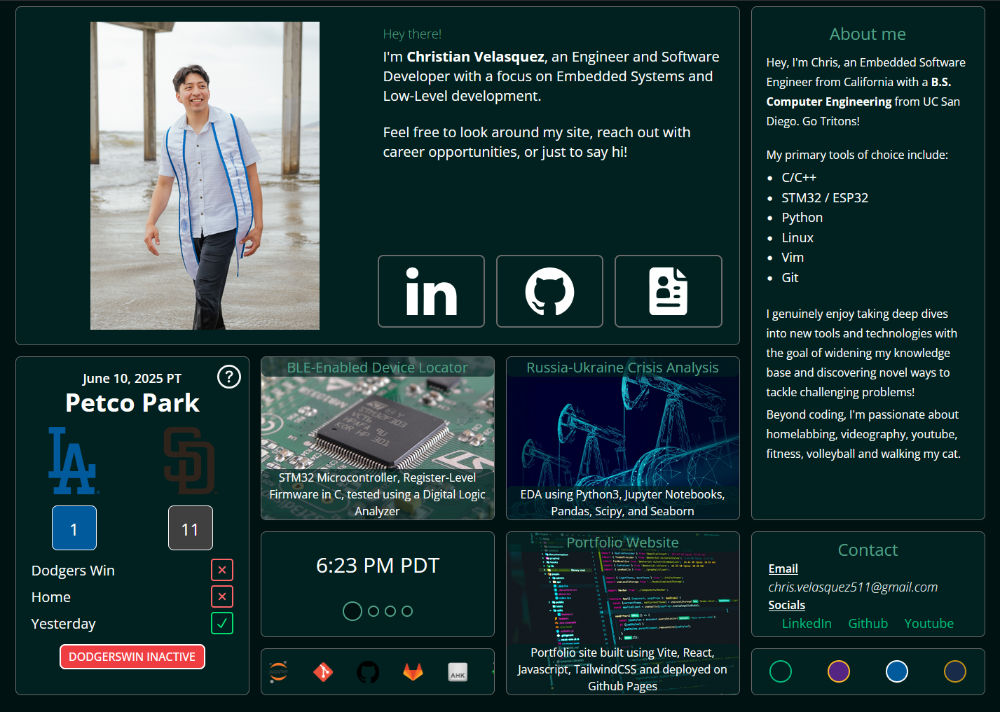
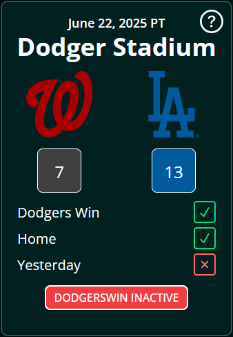

<div align="center">

# ChrisVelasquez.dev

<!-- TODO: IMAGEHERE -->

*Portfolio website with the intent to showcase my abilities and learn some React.js
while I'm at it* :sweat_smile: 




  
[Tools Used](#hammer_and_wrench-tools-used) | 
[Deployment](#rocket-deployment) | 
[Site Components](#part_alternation_mark-site-components) | 
[Restropective](#thinking-retrospective)

</div>

## :hammer_and_wrench: Tools Used
* [Vite](https://vite.dev/)
* [React](https://react.dev/)
* [Tailwind CSS](https://tailwindcss.com/) 
* [Npm]()
* [Major League Baseball API](https://statsapi.mlb.com) 
* [DateTime API](https://developer.mozilla.org/en-US/docs/Web/JavaScript/Reference/Global_Objects/Date)
* [Github Actions](https://github.com/features/actions)

## :rocket: Deployment 

Github Actions with a standard deploy.yml file,
hooked up to a domain from porkbun

## :part_alternation_mark: Site Components 

### LocalTime 


This component was relatively quick to get up and running.\
The real challenge came in correctly understanding `Intl.DateTimeFormat` object arguments
per timezone, using state management `useEffect()` for updating displayed time per minute, and 
adding a carousel effect on user interaction.

This is an example of some of the arguments that were used in this component's `Date()` calls
```js
// Top level options inherited by all calls
const globalOpts = {
  hour12: true,
  timeZoneName: "short",
  hour: "numeric",
  minute: "2-digit"
}

// Example of individual options that incorporate or overwrite inherited opts
const UTCopts = {
  __proto__: globalOpts,
  hour12: false, // overwrites inherited opt
  timeZone: "UTC",
}

// Example of call using this established objects
const example = new Date().toLocaleTimeString("en-US", UTCopts),
```
### DodgersWin



This component was a fun one and to this day still ends up saving me a couple minutes
when deciding on whether or not I should order Panda Express for lunch. 

Nearly everything in this component changes visually once we're able to process the API response JSON.

- Page supports every single possible matchup & veneue for the Dodgers 
- Score will always match Dodger blue whether they are home or away
- Date will always match the *date of the game*, not necessarily the day a visitor lands on the site

When evaluation the **Yesterday** condition there are a couple things to be aware of...\
The MLB API response includes a game date string in ***UTC*** as games may not always 
take place in the same timezone.
  1. Therefore we convert this string to a PST-formated `Date()` object, stripping everything but 
  the month and day
  2. We do the same for a site visitor's current time, converting from UTC to PST as visitors may also
  be in other areas of the world.
  3. Our component then does some basic `string` to `int` conversions and compares month and day offsets 
  in determining whether or not the frontend should be rendered as a met condition or not.

> The reason I specifically used PST for all these calculations is because the coupon is only 
valid on the west coast at select locations and is based on the Dodger's performance.

If you're interested in using this API in your own projects or learning a bit more on how I used it to
minimize received JSON pacakge and number of requests fired off, please check out 
the [Using The Public MLB API](#baseball-using-the-public-mlb-api) section.

## :baseball: Using The Public MLB API

> Note: The MLB api updates around 10am pst

Dodgers team ID: 119

MLB league ID: sportsId=1

Get previous 5 games from game schedule
`https://statsapi.mlb.com/api/v1/teams/<teamId>?hydrate=previousSchedule`

Here is the API call that I used to make a single request and recieve all necessary information without hitting
the endpoint a unnecessary amount of times. Keep in mind it looks a bit unweildy but I explain it further down
```js
const previousGames = 'https://statsapi.mlb.com/api/v1/teams/119?&hydrate=previousSchedule(team)&fields=teams,id,name,sport,id,previousGameSchedule,dates,date,gameDate,games,teams,away,home,team,venue,isWinner,abbreviation,score'
```

`https://statsapi.mlb.com/api/v1/`: Base endpoint, all queries start from here

`.../teams/{teamID}`: Teams endpoint that takes in a team ID, and other optional arguments 

`...?&hydrate=previousSchedule(team)`: `?` signifies the start of a given endpoints arguments and...
- `hydrate=` allows us to combine information from multiple API endpoints without requiring a separate API request; Very useful 
when bottlenecked by rate limits on requests. In this case we want to include information from the `previousSchedule` endpoint

`...&fields=teams,id,...{arguments}`: Fields allows user's to create API calls that only include information relevant to 
a user. Very useful in reducing response payload and streamlining the reponse to only include the desired results
- This is the bulk of why the complete API request seems so long. Often crafting this `fields` arg to your desired
results means understanding the response without any augmentation and then, **starting from the parent node**, appending
further attributes that a user wants like child attributes afterwards. Order matters

The response has a structure similar to this, *with a bit of the structure ommited for brevity*
```JSON
teams {
  id,
  name, 
  venue {
    "Dodger Stadium"
  },
  abbreviation,
  sport {
    "Major League Baseball"
  },
  previousGameSchedule {
    dates {
      // Array of last 5 games played including 
      // opponent, venue played at, date, score, etc.
    } 
  }
```
Sources:
- https://github.com/MajorLeagueBaseball/google-cloud-mlb-hackathon/tree/main/datasets/mlb-statsapi-docs
- https://github.com/mlb-ranking/mlb-dashboard
- https://github.com/toddrob99/MLB-StatsAPI/wiki

## :thinking: Retrospective  

React has some funny quirks but given that this was the first framework I've worked with, onboarding was relatively quick. 
I arguably had more trouble with the type management and debugging issues related to this since I opted for 
JavaScript due to my own familiarity. Additionally, a large chunk of time was spent working with the MLB API through trial and error to 
streamline response payloads / formating data to limit # of requests since there wasn't any official publically available documentation
to reference.
